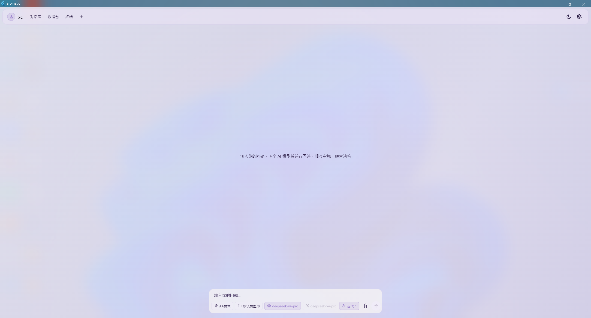
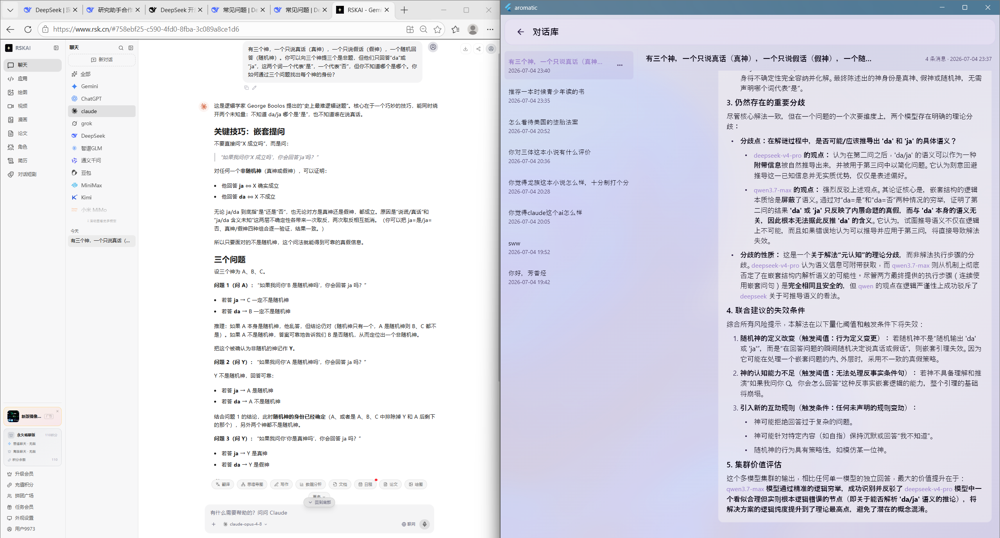

=======
# Aromatic 芳墨

桌面端多 AI 大模型协作思考平台。  
让多个大模型辩论、交叉审阅并合成联合报告——不是问一个专家，而是开一场专家辩论会。

## 功能特性

- **三种协作模式**：二元对立、六元分发、单 Agent 辩论，可调节迭代轮数
- **7 种 API 提供商适配**：OpenAI、Anthropic、DeepSeek、Moonshot、GLM、Qwen、Gemini
- **本地账户与密钥管理**：多账户、密钥串、一键连通性测试
- **数据包扩展系统**：支持社区自定义协作模式与人格
- **双语提示词引擎**：7 个内置模板，中英文切换，占位符替换
- **对话历史与导出**：自动存档会话，浏览详情，导出为 `.md` / `.txt`
- **沉浸式桌面 UI**：亚克力毛玻璃窗口，深色/浅色主题，统一设计系统
- **终端屏幕**：展示应用信息与构建命令，模拟 PowerShell 终端风格

## 技术栈

- Flutter 3.x + Dart 3.12
- 跨平台：Windows（主要）、macOS、Linux、Android、iOS、Web
- 核心依赖：`flutter_acrylic`、`shared_preferences`、`flutter_markdown_plus`

## 快速开始

2. 安装 Flutter SDK（3.x）  
   [Flutter 安装指南](https://docs.flutter.cn/get-started/install)
3. 安装依赖  
   `flutter pub get`
4. 运行应用  
   `flutter run -d windows`（或替换为你的平台）
5. 在应用内添加 API 密钥：**设置 → 账户 → 添加密钥串**

# Aromatic

A desktop multi-AI collaboration thinking platform.  
Let multiple LLMs debate, cross-examine, and synthesize a joint report — like hosting an expert panel, not asking a single advisor.

## Features

- **Three collaboration modes**: Duel, Hexad, Single-Agent Debate (AA) with configurable rounds
- **7 API provider adapters**: OpenAI, Anthropic, DeepSeek, Moonshot, GLM, Qwen, Gemini
- **Local account & keychain management**: multi-account, keychain, one-click connectivity test
- **Data Pack extension system**: community-customizable modes and personas
- **Bilingual prompt engine**: 7 built-in templates, Chinese/English switch, placeholder support
- **Conversation history & export**: auto-save sessions, browse, export as `.md` or `.txt`
- **Immersive desktop UI**: acrylic glass window, dark/light theme, unified design system
- **Terminal screen**: app info and build commands with a simulated PowerShell style

## Tech Stack

- Flutter 3.x + Dart 3.12
- Cross-platform: Windows (primary), macOS, Linux, Android, iOS, Web
- Key packages: `flutter_acrylic`, `shared_preferences`, `flutter_markdown_plus`

## Getting Started

2. Install Flutter SDK (3.x)  
   [Flutter installation guide](https://docs.flutter.dev/get-started/install)
3. Install dependencies  
   `flutter pub get`
4. Run the app  
   `flutter run -d windows` (or replace with your platform)
5. Add API keys inside the app: **Settings → Accounts → Add Keychain**
6. 
>>>>>>> 45db5b531ab6e8217b740236a5b3551a1c73ae18
